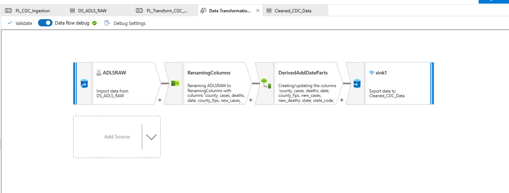
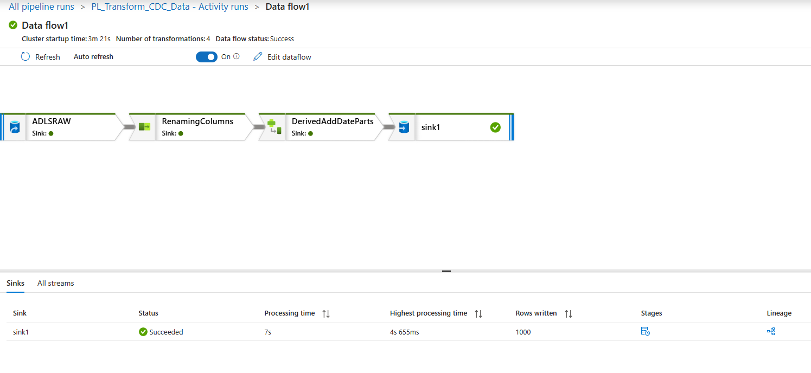

# Project 2: Data Transformation (Azure Data Factory)

## Objective

This project transforms raw CDC public health data into a clean, analytics-ready dataset using Azure Data Factory Mapping Data Flows.

## Architecture

Raw data ingested from a public API is stored in Azure Data Lake Storage (raw layer). This project processes that data and outputs a curated dataset for downstream analytics.

## Tools & Technologies

* Azure Data Factory (ADF)
* Azure Data Lake Storage Gen2 (ADLS)
* Mapping Data Flows (Spark-based)
* Parquet format (Snappy compression)

## Source Data

CDC public health dataset ingested as JSON from Project 1 and stored in:
`raw/cdc/`

## Transformation Steps

1. **Source**

   * Read JSON data from ADLS raw layer

2. **Select Transformation**

   * Selected relevant columns:

     * county, state, date, cumulative_cases, cumulative_deaths, new_cases, new_deaths
   * Renamed columns for clarity:

     * cumulative_cases → cases
     * cumulative_deaths → deaths

3. **Derived Column Transformation**

   * Created new time-based features:

     * year
     * month
     * day
   * Used string parsing and timestamp functions to extract date components

4. **Sink**

   * Wrote transformed data to:
     'curated/cdc/'
   * Output format: Parquet (Snappy compression)

## Output

Clean, structured dataset ready for analytics and reporting.

## Key Skills Demonstrated

* Data transformation using Mapping Data Flows
* Schema shaping and column standardization
* Handling timestamp parsing issues
* Writing optimized data to Parquet format
* Building layered data architecture (raw → curated)

## Screenshots

### Data Flow Canvas

### Successful Pipeline Run

