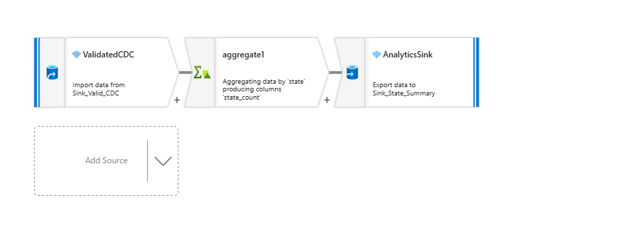
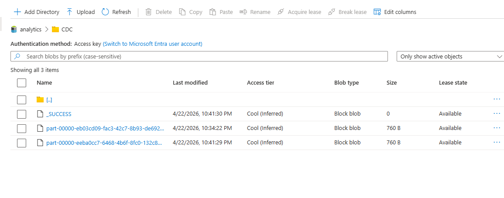

# Project 4: Analytics Layer

This phase focuses on generating insights from validated CDC data.

## Objective

Summarize data by state to confirm completeness and prepare for reporting.

## Transformation

An Aggregate transformation was used:

- Grouped by:
  - state

- Aggregation:
  - state_count = count(1)

## Output

Data was written to:

- analytics/state_summary

## Result

The output confirms:
- Multiple states exist in the dataset
- Data was successfully processed end-to-end

## Analytics Data Flow

## Output Example

## Key Insight

This aggregation confirms that the dataset is complete and ready for downstream analytics and reporting.
